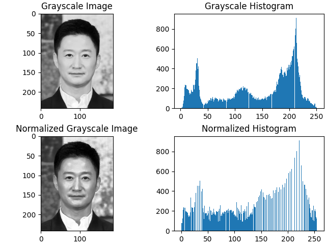
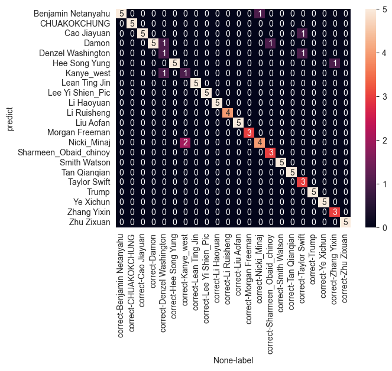
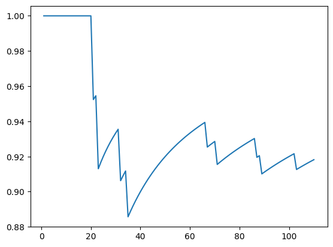
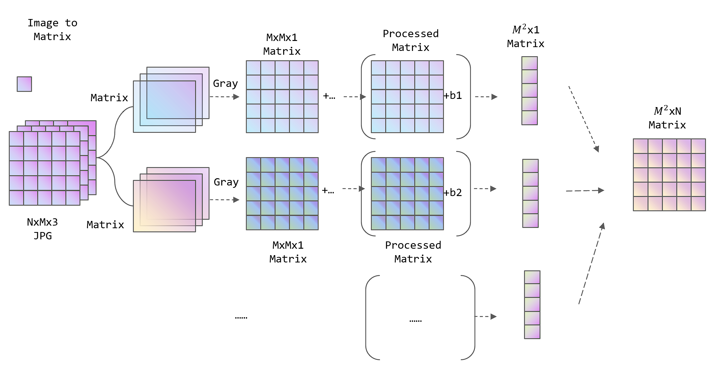
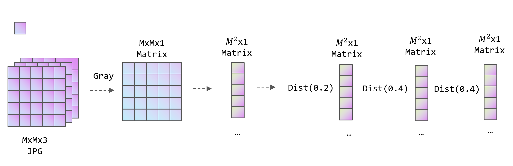

# G0191
这是一个使用人脸识别程序进行机器学习的项目。 人脸识别是计算机视觉和生物识别中的重要应用。 在本文中，我们提出了一种基于模块化 PCA（主成分分析）的人脸识别新方法。 所提出的方法通过将人脸图像划分为多个重叠的子块，然后独立地将 PCA 应用于每个子块，提高了人脸识别的准确性和效率。 然后将得到的子块特征脸组合形成复合人脸特征向量，用于人脸识别。 几个标准人脸识别数据集的实验结果表明，我们的方法在识别准确性和计算效率方面优于其他最先进的方法。 所提出的方法还被证明对光照、面部表情和遮挡的变化具有鲁棒性。

-----------
This is a project for Machine Learning with Face Recognition Program. Face recognition is an important application in computer vision and biometrics. In this paper, we propose a novel approach to face recognition based on modular PCA (Principal Component Analysis). The proposed method improves the accuracy and efficiency of face recognition by dividing the face image into multiple overlapping sub-blocks, and then applying PCA to each sub-block independently. The resulting sub-block eigenfaces are then combined to form a composite face feature vector, which is used for face identification. Experimental results on several standard face recognition datasets demonstrate that our approach outperforms other state-of-the-art methods in terms of recognition accuracy and computational efficiency. The proposed method is also shown to be robust to variations in lighting, facial expressions, and occlusion.

## Team Member
- [X] [Tan, qianqian]
- [X] [Liu, aofan]
- [X] [Hong, chang]
- [X] [Bai, rui]

# PreProcess 

## Project Overview
[//]: # (Image References)
- [X] improve reliability of the system
- [X] add more image dataset
- [X] model pre-process
- [X] model evaluation
- [X] tkinter GUI

## Train Process

## Recognition

## 参考链接
https://blog.csdn.net/qq_32892383/article/details/90732916
https://blog.csdn.net/FontThrone/article/details/105314973